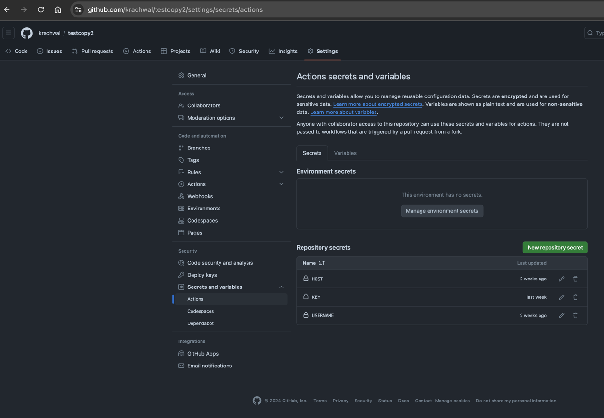
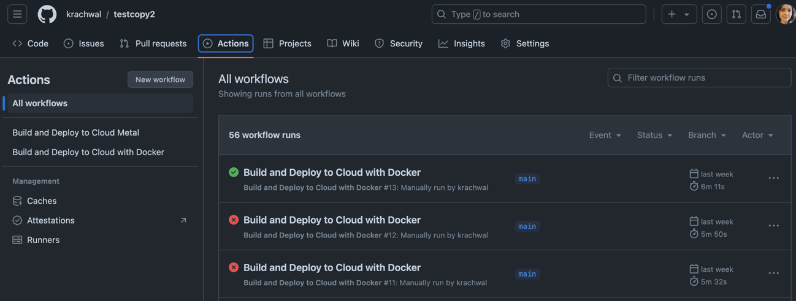
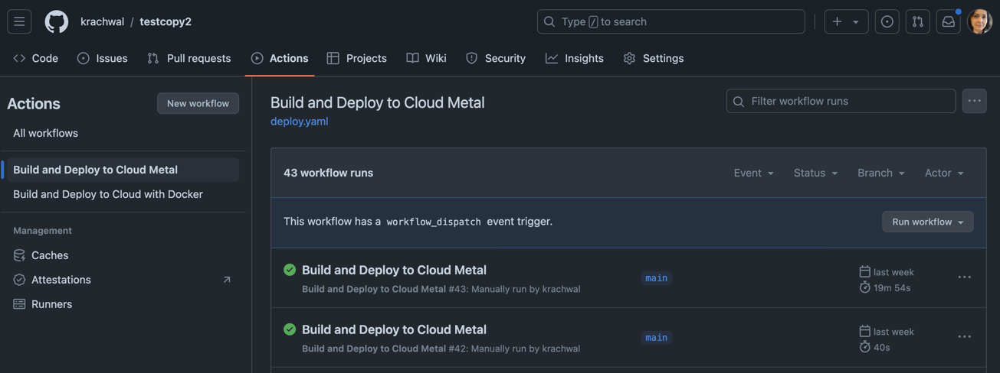
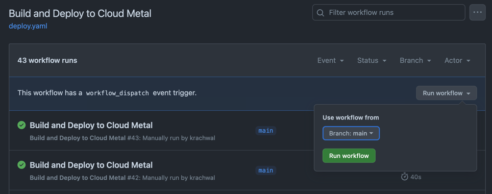
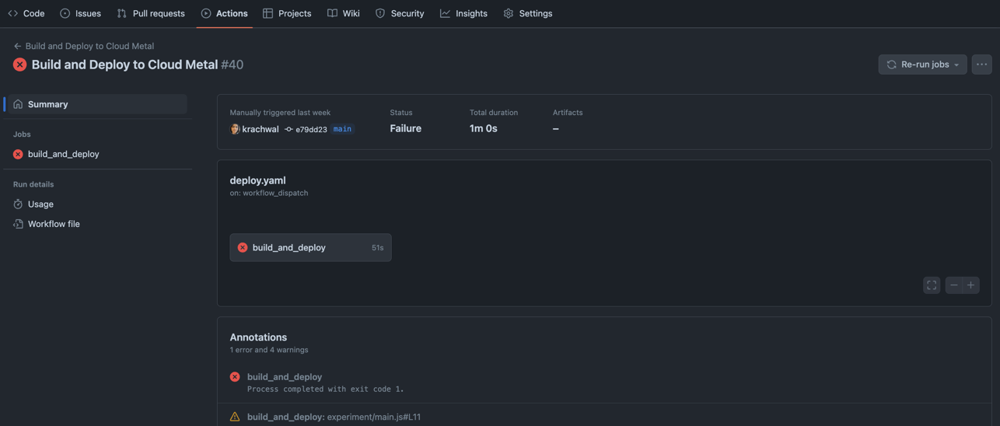
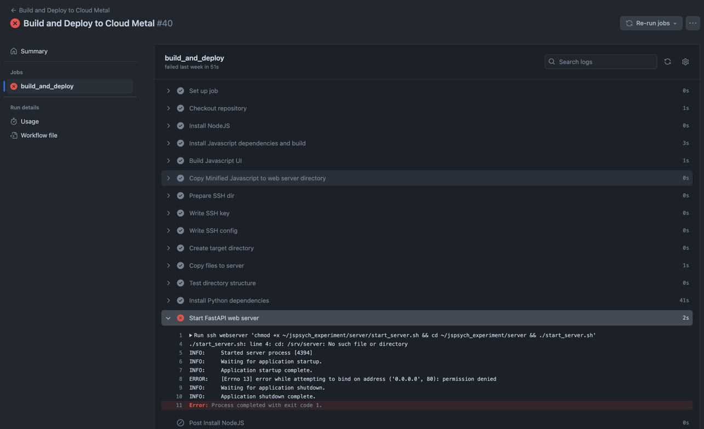

# Provided CI/CD GitHub Actions Workflows

The deployment process consists of two GitHub Actions. 

[deploy.yaml](..%2Ftemplate%2F.github%2Fworkflows%2Fdeploy.yaml) attempts to deploy to a generic Linux instance. It expects `apt` as the package manager on that server. 

[deploy_w_docker.yaml](..%2Ftemplate%2F.github%2Fworkflows%2Fdeploy_w_docker.yaml) attempts to deploy to a Linux instance with Docker installed. 

They both require the setting of some GitHub Action variables. This can be accomplished from your repository's `Settings` page found at https://github.com/your-user/your-repo/settings/secrets/actions

- `HOST` should be the domain name or IP address of the web server.
- `KEY` should be the `ssh` key to connect to the web server.
- `USERNAME` should be the username of the `ssh` user. This user will own the server process.

Both deployment processes are configured to be manually triggered. In the Actions tab of your repository, you should see the "Build and Deploy to Cloud Metal" and "Build and Deploy to Cloud with Docker" actions on the left navigation menu. Clicking on either of these actions should show you a list of prior executions. In the upper right of the list you will find a "Run workflow" button. 

Clicking on this button will allow you to select which branch to run the deployment from:

Some tweaks to the configuration may be necessary for your server. GitHub makes it easy to determine what went wrong with a workflow. Successful workflows bear a green checkmark and failures display a red circle. Clicking on a failed workflow drills into a more detailed view.

Clicking on the `build_and_deploy` bubble in the diagram pane drills in even further to show you exactly what went wrong.

Adjust accordingly and relaunch from your working branch.

For detailed documentation on GitHub Actions workflows refer to [the official documentation](https://docs.github.com/en/actions/writing-workflows).